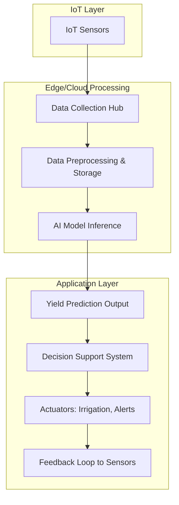

# Task 2: AI-Driven IoT Concept - Smart Agriculture Simulation System

## Scenario
Design a smart agriculture simulation system using AI and IoT to monitor and optimize crop growth in a simulated farm environment. The system will collect real-time data from sensors, process it using AI models, and provide insights for predictive analytics, such as yield prediction and irrigation optimization.

## Requirements Fulfillment

### 1. List of Sensors Needed
The following sensors are essential for monitoring environmental and soil conditions in a smart agriculture setup. These sensors will collect data to feed into the AI model for analysis and prediction:

- **Soil Moisture Sensor**: Measures the water content in the soil to determine irrigation needs and prevent over- or under-watering.
- **Temperature Sensor**: Monitors ambient air temperature and soil temperature to assess optimal growing conditions and detect heat stress.
- **Humidity Sensor**: Tracks relative humidity levels in the air, which affects plant transpiration and disease risk.
- **Light Intensity Sensor (Photometer)**: Measures sunlight exposure to ensure adequate photosynthesis and detect shading issues.
- **pH Sensor**: Monitors soil pH levels to maintain optimal acidity for nutrient absorption.
- **Rainfall Sensor**: Detects precipitation to adjust irrigation schedules and predict water availability.
- **Wind Speed and Direction Sensor**: Assesses wind conditions that could impact pollination or cause physical damage to crops.
- **CO2 Sensor**: Measures carbon dioxide levels, which influence photosynthesis rates in controlled environments.

These sensors can be deployed as IoT devices (e.g., via Arduino or Raspberry Pi modules) connected wirelessly to a central hub for data aggregation.

### 2. Proposed AI Model to Predict Crop Yields
To predict crop yields, we propose using a **Machine Learning Regression Model**, specifically a **Random Forest Regressor** or **Gradient Boosting Machine (GBM)** like XGBoost, trained on historical and real-time sensor data. This model will forecast yields based on features such as soil moisture, temperature, humidity, light intensity, pH, and historical yield data.

- **Model Architecture**:
  - **Input Features**: Time-series data from sensors (e.g., daily averages of moisture, temperature, etc.), weather forecasts, and crop type/variety.
  - **Preprocessing**: Data normalization, handling missing values, and feature engineering (e.g., rolling averages, seasonal trends).
  - **Training Data**: Simulated or historical datasets (e.g., from sources like Kaggle's crop yield datasets or generated synthetic data).
  - **Algorithm**: Random Forest for its robustness to overfitting and ability to handle mixed data types. Alternatively, a Neural Network (e.g., LSTM for time-series prediction) if temporal dependencies are emphasized.
  - **Output**: Predicted yield in kg/hectare or bushels/acre, with confidence intervals.
  - **Evaluation Metrics**: Mean Absolute Error (MAE), Root Mean Squared Error (RMSE), and R-squared for accuracy assessment.
  - **Deployment**: The model will be deployed on an edge device (e.g., using TensorFlow Lite) for real-time inference, reducing latency and bandwidth.

This AI model will enable proactive decision-making, such as adjusting irrigation or applying fertilizers, to maximize yields.

### 3. Data Flow Diagram
The following Mermaid chart illustrates the data flow in the smart agriculture system, focusing on how sensor data is collected, processed by AI, and used for decision-making.

- **Explanation**:
  - **IoT Sensors**: Collect raw data (e.g., moisture, temperature).
  - **Data Collection Hub**: Aggregates and transmits data wirelessly.
  - **Data Preprocessing & Storage**: Cleans, normalizes, and stores data in a database (e.g., time-series DB like InfluxDB).
  - **AI Model Inference**: Runs the trained model on preprocessed data to predict yields.
  - **Yield Prediction Output**: Provides predictions and insights.
  - **Decision Support System**: Analyzes predictions to generate recommendations.
  - **Actuators**: Triggers actions like automated irrigation or user alerts.
  - **Feedback Loop**: Adjusts based on outcomes, improving model accuracy over time.

This diagram represents a closed-loop system where AI processes sensor data for predictive analytics in smart agriculture.
